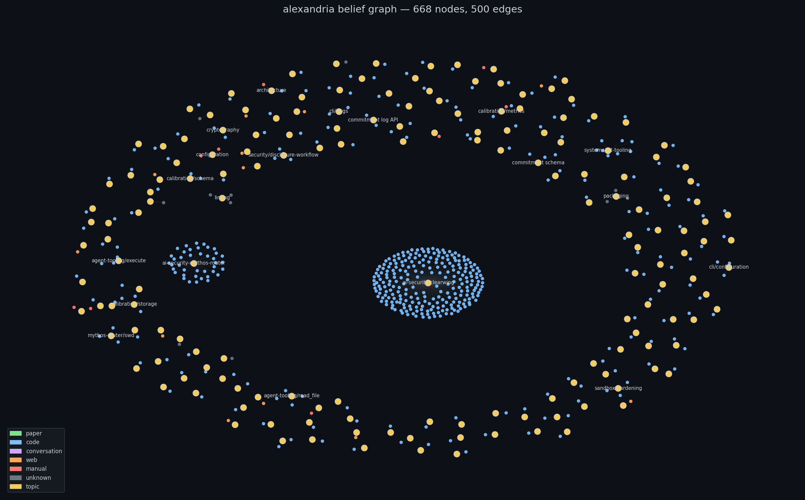

# Alexandria

**Give your AI coding agent a persistent, citable knowledge base.**
alexandria ingests papers, articles, code, and conversations into a
local wiki with verified quote citations — and exposes it over MCP so
Claude Code, Cursor, Codex, and other MCP-capable agents can
retroactively query, cross-reference, and synthesize everything you've
ever fed it.

```bash
pip install alexandria-wiki && alxia init
alxia ingest https://arxiv.org/abs/2307.03172
alxia mcp install claude-code
# now ask your agent — the knowledge is there, with citations back to source
```



*Live belief graph from a real vault — 668 nodes, 500 edges. Blue =
code-derived, yellow = topic hubs, orange = web, green = papers.
Generate your own with `alxia export <dir> --format graph`.*

## Three things alexandria does that most "feed-your-LLM-a-folder" tools don't

- **Durable across sessions.** Knowledge accumulates in
  `~/.alexandria/`; every ingest is a staged, verified write, not a
  regenerate-from-scratch pass.
- **Every claim has a citation.** A deterministic verifier checks that
  each footnote maps to a verbatim quote in the original source via
  SHA-256 anchors — no hallucinated references.
- **Belief revision, not just retrieval.** Structured claims with
  supersession chains. Ask `alxia why <topic>` and you get what was
  believed, what superseded it, and why.

## Capabilities

- **Ingest** from 14+ source types: files, directories, URLs, git
  repos, PDFs, code, RSS, IMAP, YouTube, Notion, HuggingFace,
  Obsidian vaults, archives, Claude Code conversations
- **Search** with hybrid BM25 + recency + belief support scoring
- **Query** with LLM-powered grounded answers that cite sources
- **Track beliefs** as structured claims with supersession chains
- **Extract code structure** from Python, TypeScript, Rust, Go,
  Terraform, Ansible, YAML via tree-sitter / AST
- **Capture conversations** from Claude Code sessions with artifact
  extraction
- **Cascade merge** — new sources on existing topics merge into the
  appropriate page with per-source attributable sections
- **Cross-reference** related wiki pages with auto-discovered See Also
  links

## Core design

- **No vectors, no RAG.** The agent IS the retriever; alexandria
  exposes FTS5 + grep + belief graph + cross-ref follow as primitives.
- **Filesystem is source of truth.** SQLite is a materialized view;
  lose the DB, rebuild via `alxia reindex --rebuild-beliefs`.
- **Every wiki write goes through a deterministic verifier.** Commits
  fail if citations don't validate.
- **Hybrid search.** FTS5 BM25 + recency decay + belief support as a
  composite score.

## One-line capability check

```bash
alxia bench
```

Sample output from a real vault:

```
864 pages · 15,589 beliefs across 3,804 topics · 1,664 verified ingests
· search 41ms / 386ms P95 · citation-verified rate: 99.9%
```

## Learn more

- [Getting Started](guide.md) — full user guide
- [CLI Reference](cli.md) — all commands
- [MCP integration](guides/mcp_integration.md) — scope, workspace pinning, gotchas
- [Mobile vault via GitHub](guides/mobile_vault_github.md) — read on any device, capture on the go
- [Architecture](architecture/README.md) — design documents
